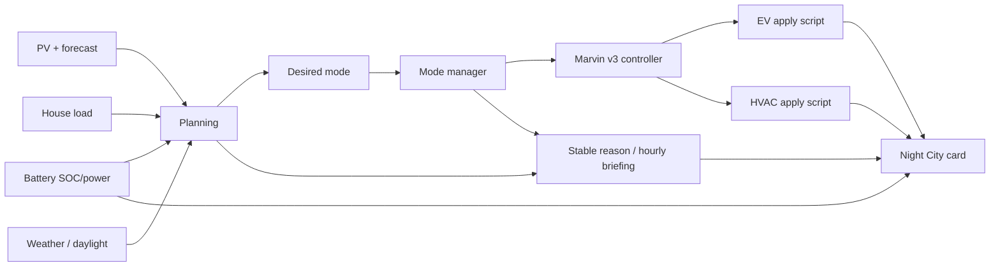

# Marvin v3 architecture

Marvin is a layered Home Assistant energy director used by the Night City card.
It separates planning from action so the UI can explain what the controller is
thinking without making the renderer itself responsible for control decisions.

## Modes

- **Normal**: default balanced operation.
- **Conservation**: protect morning SOC / avoid projected grid need.
- **Abundant**: spend excess solar before clipping or curtailment.
- **Storm**: reserve-focused behavior for weather risk.
- **Outage**: grid unavailable.
- **Fault**: required data/control path is unhealthy.

The v3 mode manager uses immediate transitions for safety states and manual
modes, while normal energy-state changes use stability delays to avoid mode
thrashing.

## Main controller

`automation.marvin_v3_controller` runs on a one-minute cadence and on relevant
state changes. When Live Control is enabled, it delegates actions to:

- `script.energy_director_apply_ev`
- `script.marvin_v3_apply_hvac`

The scripts own the hardware-specific actuation details. This is deliberate:
planning logic should not know how a particular EVSE button or thermostat API
works.

## Commentary

`input_text.marvin_hourly_briefing` holds the hourly terminal-style message used
by the card. The text is condition-aware but deterministic and intentionally
avoids copied dialogue.
